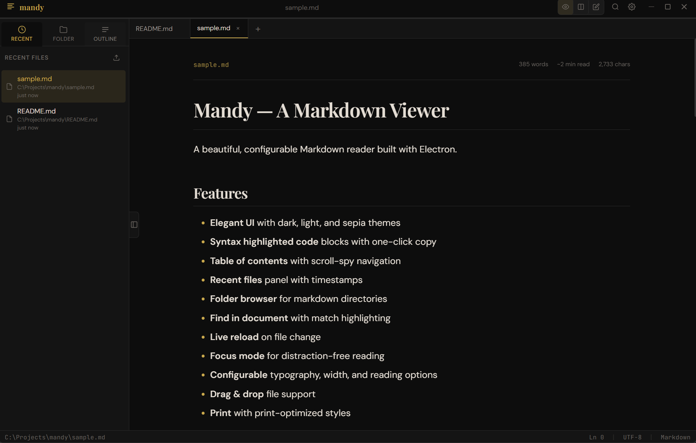
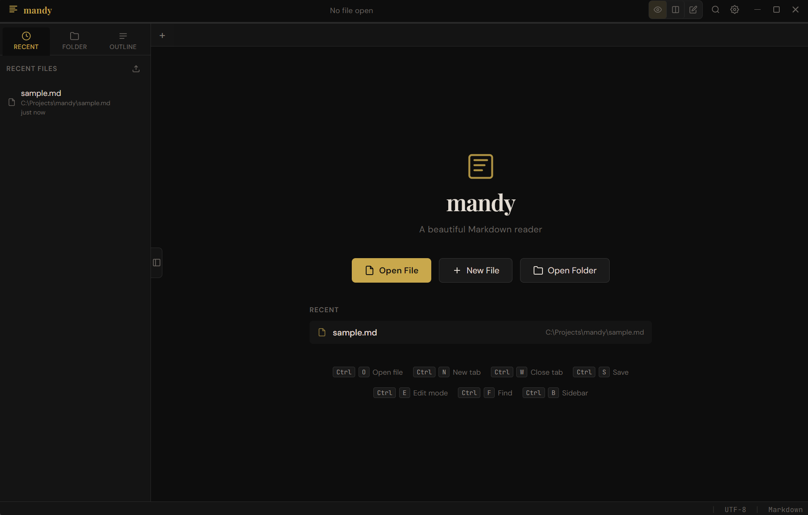
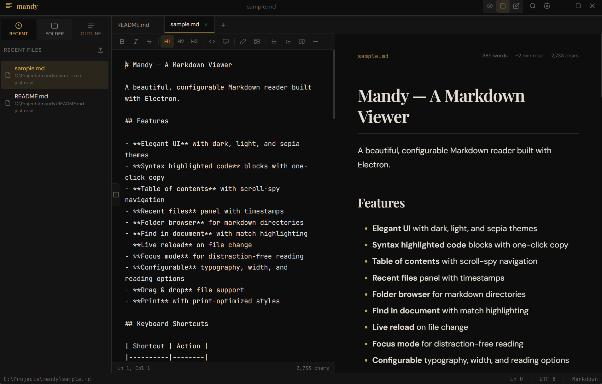
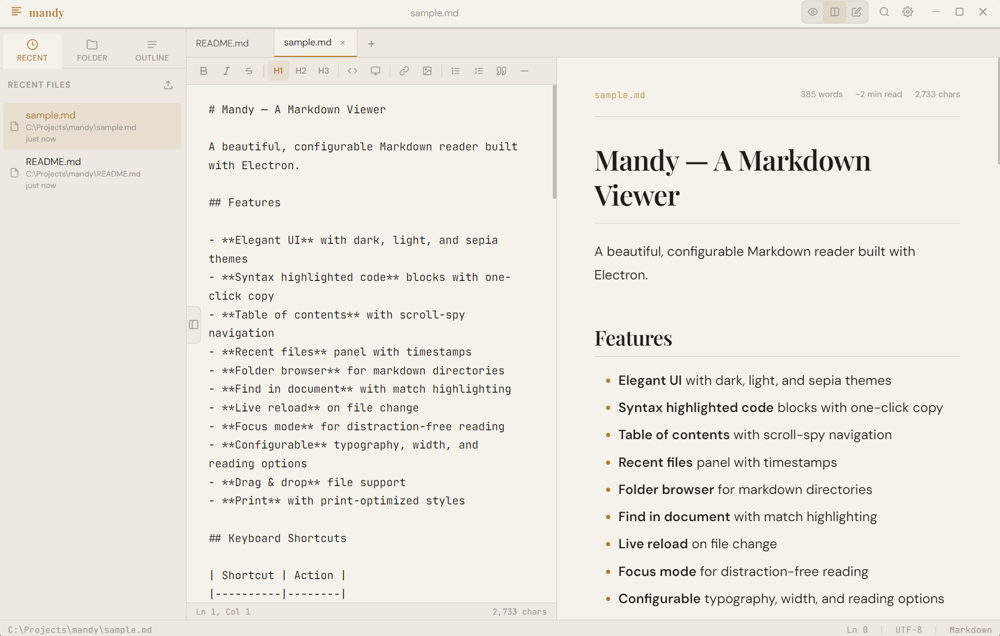
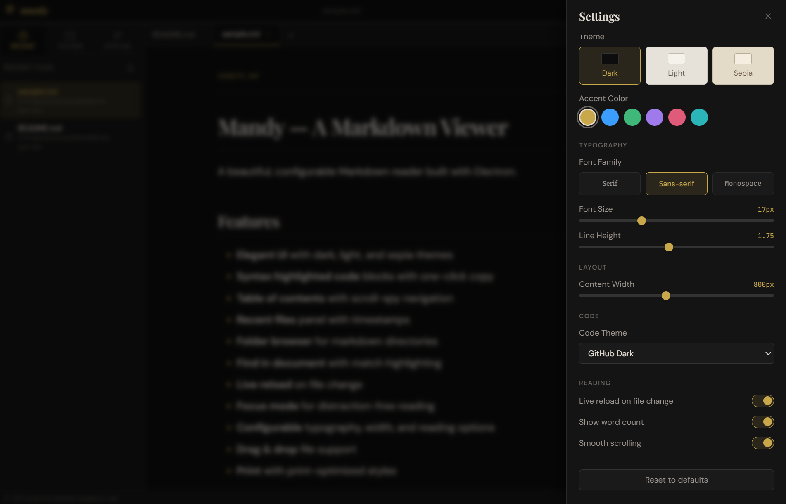
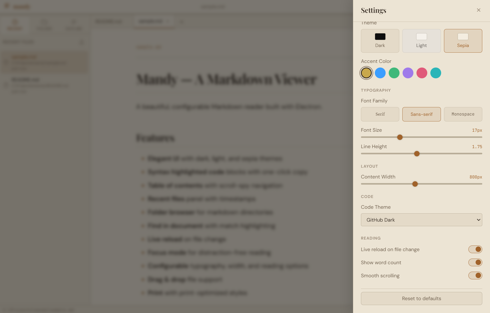
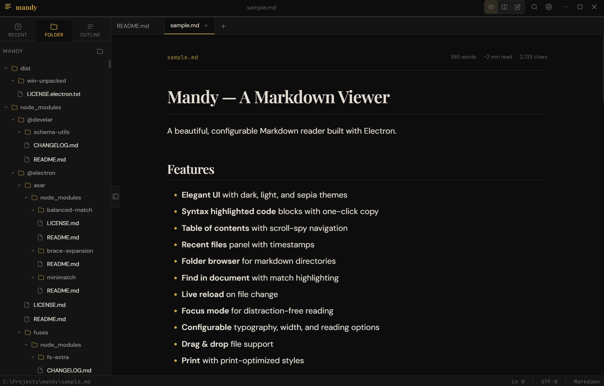
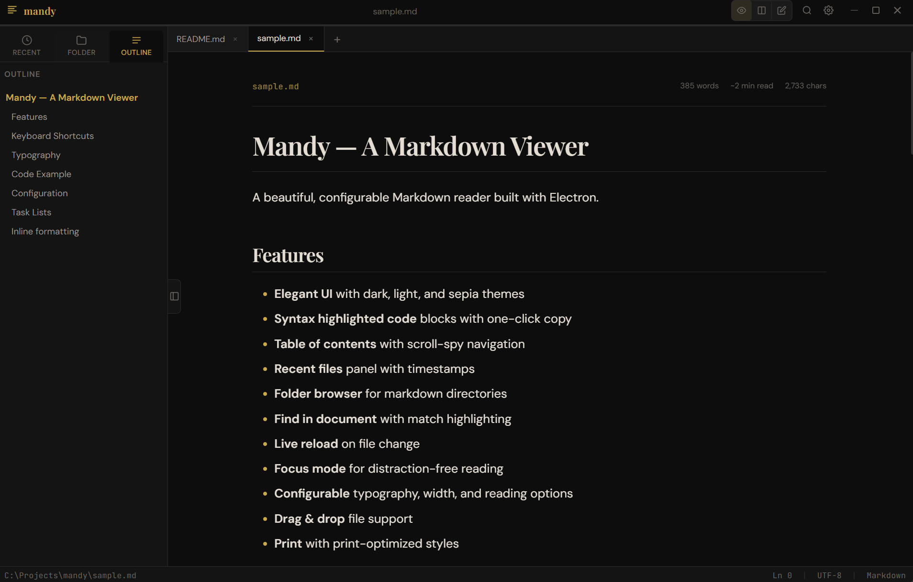

<div align="center">


# Mandy

**A beautiful, distraction-free Markdown reader and editor for the desktop.**

[](LICENSE)
[](https://github.com/NooberCong/mandy/releases)
[](https://www.electronjs.org)
[](https://github.com/NooberCong/mandy/releases/latest)

[**Download**](#-download) · [Features](#-features) · [Keyboard Shortcuts](#-keyboard-shortcuts) · [Development](#-development)

---

<!-- SCREENSHOT: Full app window in dark theme with a document open -->


</div>

---

## ✨ Features

### Reading Experience
- **Three view modes** — Preview, Split (live editor + preview side by side), and Edit
- **Beautiful typography** — Playfair Display headings, Crimson Pro body, JetBrains Mono code
- **Syntax highlighted code blocks** — 9 built-in themes (GitHub Dark, Monokai, Dracula, and more) with one-click copy
- **Reading progress bar** — always know where you are in long documents
- **Word count & read time** — displayed per document
- **Smooth scroll** with custom scroll indicator

### Navigation
- **Multi-tab interface** — open as many files as you like, each with its own scroll and view state
- **Folder browser** — open a directory and navigate all `.md`, `.markdown`, `.mdx`, and `.txt` files
- **Table of contents** — auto-built from headings with scroll-spy highlighting
- **Recent files** — jump back to the last 20 files with relative timestamps
- **Find in document** — full-text search with highlighted matches and Prev/Next navigation

### Editing
- **Markdown editor** with a formatting toolbar (Bold, Italic, Strikethrough, H1–H3, Code, Links, Lists, Blockquotes, HR)
- **Smart keyboard shortcuts** — `Ctrl+B/I/K/`` for formatting, `Tab` inserts 2 spaces, `Enter` continues list items automatically
- **Live preview** updates as you type (400 ms debounce in split mode)
- **Unsaved indicator** — a dot (●) in the tab and title bar marks pending changes
- **Autosave** — settings are always saved; documents save on `Ctrl+S`

### File Handling
- **Drag & drop** files or folders directly onto the window
- **Smart link routing** — `.md` links open in a new tab, other files open with the system default app, URLs open in the browser
- **Live reload** — document auto-refreshes when the file changes on disk
- **Print** with print-optimised styles (`Ctrl+P`)

### Appearance & Personalisation
- **3 themes** — Dark (default), Light, Sepia
- **6 accent palettes** — Amber, Sky, Emerald, Violet, Rose, Teal
- **3 font families** — Serif (Crimson Pro), Sans-serif (DM Sans), Monospace (JetBrains Mono)
- **Configurable** font size (12–28 px), line height, and content width
- **Focus mode** — hides the sidebar and dims chrome for distraction-free reading
- **Zoom** — `Ctrl+=` / `Ctrl+-` / `Ctrl+0`

### Internationalisation
- **7 languages** — English, Español, Français, Deutsch, Português, 日本語, 中文

---

## 🖼 Screenshots

<!-- SCREENSHOT: Welcome screen -->
| Welcome screen | Dark theme |
|---|---|
|  |  |

<!-- SCREENSHOT: Split view with editor and preview side by side -->
| Split view (editor + live preview) | Light theme |
|---|---|
|  |  |

<!-- SCREENSHOT: Settings panel open -->
| Settings panel | Sepia theme |
|---|---|
|  |  |

<!-- SCREENSHOT: Folder browser + TOC sidebar -->
| Folder browser | Table of contents |
|---|---|
|  |  |

---

## ⬇ Download

Grab the latest build from the [**Releases**](https://github.com/NooberCong/mandy/releases/latest) page.

| File | Description |
|---|---|
| `Mandy Setup x.x.x.exe` | Windows installer (recommended) |
| `Mandy-x.x.x-portable.exe` | Portable — single executable, no installation required |
| `Mandy-x.x.x-win.zip` | Zip archive |

> **Windows only** for now. macOS / Linux builds are not yet available.

### Installer (`Mandy Setup x.x.x.exe`) — recommended

The standard installer registers Mandy with Windows so it appears as a recommended app when you open a `.md`, `.markdown`, or `.mdx` file.

1. Run `Mandy Setup x.x.x.exe`
2. Choose an install directory (or accept the default)
3. Click **Install**

After installation, double-clicking any Markdown file will offer Mandy as the app to open it. You can set it as the default by right-clicking a `.md` file → **Open with → Choose another app → Mandy → Always**.

### Portable (`Mandy-x.x.x-portable.exe`) — no installation

A self-contained single executable — just run it. No files are written to your system beyond settings stored in `%APPDATA%\Mandy`.

- No admin rights required
- Copy it to a USB drive or any folder and run it from there
- Does **not** register file associations (`.md` files won't open with Mandy by double-click)

### Zip archive (`Mandy-x.x.x-win.zip`)

Extract anywhere and run `Mandy.exe` inside. Behaviour is the same as the portable build — no file associations registered.

---

## ⌨ Keyboard Shortcuts

### File & Tabs

| Shortcut | Action |
|---|---|
| `Ctrl+O` | Open file |
| `Ctrl+N` | New file |
| `Ctrl+T` | New tab (welcome screen) |
| `Ctrl+W` | Close current tab |
| `Ctrl+Tab` | Next tab |
| `Ctrl+Shift+Tab` | Previous tab |
| `Ctrl+S` | Save file |

### View

| Shortcut | Action |
|---|---|
| `Ctrl+E` | Toggle Edit / Preview mode |
| `Ctrl+Shift+E` | Split view |
| `Ctrl+Shift+P` | Preview mode |
| `Ctrl+B` | Toggle sidebar |
| `Ctrl+Shift+F` | Focus mode |
| `Ctrl+=` | Zoom in |
| `Ctrl+-` | Zoom out |
| `Ctrl+0` | Reset zoom |

### Editing

| Shortcut | Action |
|---|---|
| `Ctrl+B` | Bold |
| `Ctrl+I` | Italic |
| `Ctrl+K` | Insert link |
| `` Ctrl+` `` | Inline code |
| `Tab` | Indent (2 spaces) |
| `Escape` | Return to Preview |

### Navigation

| Shortcut | Action |
|---|---|
| `Ctrl+F` | Find in document |
| `Ctrl+P` | Print |
| `Ctrl+,` | Settings |

---

## 🛠 Development

### Prerequisites

- [Node.js](https://nodejs.org) 18 or later
- npm

### Run locally

```bash
git clone https://github.com/NooberCong/mandy.git
cd mandy
npm install
node scripts/create-icon.js   # generate app icons (one-time)
npm start
```

### Build installers

```bash
npm run build
# outputs to dist/
```

### Release

Tag a commit and push — GitHub Actions builds and publishes automatically:

```bash
git tag v1.2.0
git push origin v1.2.0
```

### Project structure

```
mandy/
├── main.js              # Electron main process — IPC, file system, menu
├── preload.js           # Context bridge — exposes APIs to the renderer
├── renderer/
│   ├── index.html       # App shell
│   ├── styles.css       # All styling (CSS variables for theming)
│   └── renderer.js      # All UI logic and event handling
├── scripts/
│   └── create-icon.js   # Generates assets/icon.ico + icon.png (no deps)
├── assets/
│   ├── icon.ico
│   └── icon.png
└── .github/
    └── workflows/
        └── release.yml  # CI: build + publish on version tag
```

### Tech stack

| | |
|---|---|
| **Runtime** | [Electron 33](https://electronjs.org) |
| **Markdown** | [marked 13](https://marked.js.org) |
| **Syntax highlighting** | [highlight.js 11](https://highlightjs.org) |
| **UI** | Vanilla JS — no framework |
| **Fonts** | Playfair Display · Crimson Pro · DM Sans · JetBrains Mono (Google Fonts) |

---

## 📄 License

[MIT](LICENSE) © NooberCong
